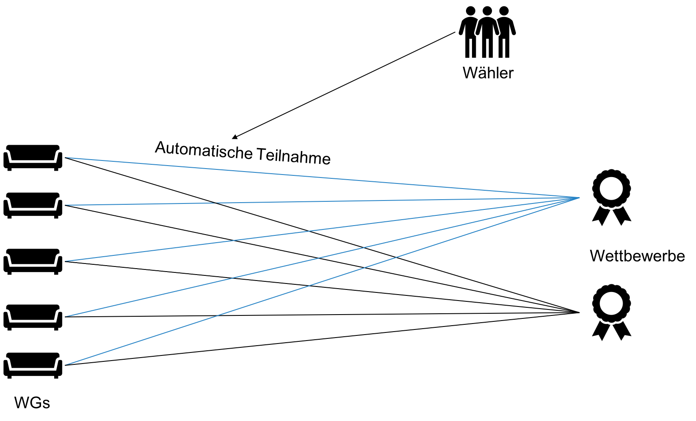

# Fact Sheet / Dokumentation

## Ziel

Das Ziel ist eine grösstenteils auf XML basierte Web-Applikation zu entwickeln. Zweck dieser Web-Applikation soll sein Wettbewerbe ausschreiben zu können an denen Wohngemeinschaften Preise gewinnen können. Die Gewinner werden mittels eines Voting-Systems bestimmt. Wettbewerbe werden hauptsächlich von Unternehmen ausgeschrieben und dienen somit in erster Linie als Werbung. Wir nennen diese Form von Marketing "Crowdsourced Contest Marketing".

## Das Prinzip

* Wettbewerbe werden (von Unternehmen) ausgeschrieben
* Registrierte Wohngemeinschaften nehmen automatisch an allen Wettbewerben teil
* Wohngemeinschaften erhalten einen eigenen Link, den sie mit Freunden (Wählern) teilen können
* Über diesen Link können die Freunde (Wähler) alle aktuellen Wettbewerbe sehen und Stimmen für diese Wohngemeinschaft für die einzelnen Wettbewerbe abgeben 

## Marktanalyse

Das Projekt hat folgende Stakeholder,

* Wohngemeinschaften
  * Können von Wettbewerben profitieren
  * Erhalten vielleicht Insentives bestimmte Handlungen zu machen
* Unternehmen
  * Erreichen junge Stundenten mit dem Erstellen von Wettbewerben
  * Können Personen in Wohngemeinschaften dazu bewegen bestimmte Handlungen zu machen
* Umwelt
  * Wir versuchen mit dieser Applikation auch umweltfreundliche Trends zu starten oder unterstützen, indem Unternehmen Wettbewerbe mit einem "Green-Insentive" gestalten
* Wähler
  * Verknüpfen die Unternehmen mit den "coolen" oder "grünen" Wettbewerben

Das Innovative an dieser Webapplikation sehen wir im Crowdsourced Marketing. Unternehmen können ihr umweltfreundliches Image verbessern in dem sie durch grüne Wettbewerbe einen Reiz erzeugen können. 

## Marktfeld / Finanzen

Als Haupteinkommen könnte den Unternehmen eine Vermittlungsgebühr verrechnet werden für das Ausschreiben von Wettbewerben. Eine weitere Einkommensquelle könnte durch gezieltes Sponsering entstehen.

## Technischer Aufbau

### Backend

* PHP
* XML / XHTML

Auf dem Backend läuft ein PHP-Server, welcher als Eintrittspunkt der Web-Applikation dient. Das Ausgangsfile ist somit `index.php`, das rein als Weiterleitung auf `index.xml` dient. Im File `index.xml` stehen die Processing-Instructions, die auf das Stylesheet `index.xsl` und die Daten `db.xml` verweisen. Das grundlegende Layout wurde mit Hilfe eines HTML-Templates (www.html5up.net) erstellt. Im File `index.xsl` wird dann ein einfaches XSLT erstellt, wobei gemäss Route und XPath mittels `apply-templates` das bestimmte XML generiert wird. Um die Votes ins File-System zu schreiben wird wieder PHP verwendet.

### Frontend

* JavaScript / CSS

Um eine bessere UX zu schaffen, wurde Javascript verwendet, um die Seiten dynamischer zu gestalten. Ein CSS-Stylesheet verleiht der Applikation zusätzlich ein schöneres Design (auch von www.html5up.net).

### Hauptelemente

Die folgenden Daten werden auf dem Server gespeichert,

* Wohngemeinschaften
  * Name der WGs
  * Personen
  * Ort / Kanton

* Wettbewerbe
  * Name
  * Firma
  * Beschreibung
  * Stimmen
  * Start- / Enddatum

## Features

Die Applikation soll über die unten aufgelisteten Features verfügen,

1. Ausschreibung Wettbewerb
   * Erfassung
   * Übersicht aller Wettbewerbe
2. Einschreibung Wohngemeinschaft
   * Erfassung / Bearbeitung
   * Übersicht einer Wohngemeinschaft
3. Abstimmen
   * Stimme vergeben
   * Übersicht Ranking

## Architektur

