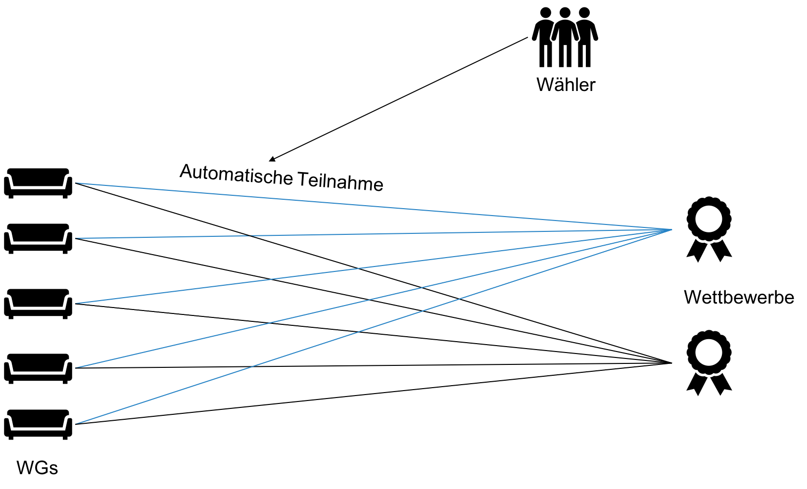
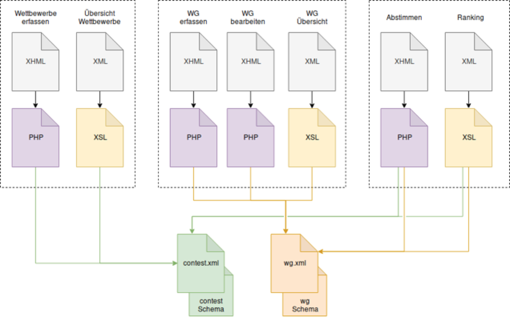

# Ziel

Das Ziel des Projektes ist es eine grösstenteils auf XML basierte
Web-Applikation zu entwickeln. Zweck dieser Applikation soll es sein
Wettbewerbe auszuschreiben, an denen Wohngemeinschaften Preise gewinnen
können. Die Gewinner eines Wettbewerbe werden mittels eines öffentichen
Voting-Systems bestimmt. Die Wettbewerbe werden primär  von Unternehmen
ausgeschrieben und dienen somit hauptsächlich als Werbung. Diese Form des
Marketing nennen wir "Crowdsourced Contest Marketing".

# Das Prinzip

* Wettbewerbe werden von Unternehmen ausgeschrieben
* Registrierte WGs nehmen automatisch an allen Wettbewerben teil
* WGs erhalten pro Wettbewerb einen Abstimmungslink in Form eines QR-Code
* Diesen Link können sie nun mit ihren Wählern teilen
* Die Wähler können alle aktuellen Wettbewerbe sehen und für eine WG stimmen

# Marktanalyse

Das Projekt hat folgende Stakeholder:

* Wohngemeinschaften
    * Können von Wettbewerben mit Preisen profitieren
    * Erhalten vielleicht die Idee etwas Gutes zu tun
* Unternehmen
    * Erreichen junge Stundenten mit den Wettbewerben
    * Können Personen in WGs dazu bewegen etwas gutes zu tun
* Umwelt
    * Mit der Applikation sollen umweltfreundliche Trends unterstützt werden
    * Unternehmen sollen Wettbewerbe mit einer "Green-Initiative" aufschalten
* Wähler
    * Verknüpfen die Unternehmen mit den "coolen" oder "grünen" Wettbewerben

Das Innovative an dieser Webapplikation sehen wir im Crowdsourced Marketing.
Unternehmen können ihr umweltfreundliches Image verbessern, in dem sie durch
grüne Wettbewerbe einen Reiz erzeugen können.

# Marktfeld / Finanzen

Als Haupteinkommen wird den Unternehmen eine Vermittlungsgebühr verrechnet
für das Ausschreiben der Wettbewerben. Eine zusätzliche Einkommensquelle
könnte durch gezieltes Sponsering oder Werbung auf der Seite enstehen.

# Technischer Aufbau

## Backend

Auf dem Backend läuft ein PHP-Server, welcher als Eintrittspunkt in die
Web-Applikation dient. Dazu wird eine `index.php` verwendet, welche auf
die Datei `index.xml` weiterleitet. In der Datei `index.xml` wird auf
XML-Processing-Instructions verwiesen die in der Datei `index.xsl` definiert
sind.

Als Datenbank dient die Datei `db.xml`, welche von den
Processing-Instructions geladen wird. Das grundlegende Layout wurde mit
Hilfe eines HTML-Templates (www.html5up.net) erstellt. In der Datei
`index.xsl` ist ein XSLT definiert, dass dann gemäss Route und XPath
mittels `apply-templates` die korrkete XML-Ausgabe generiert. Um die neue
Stimmen abzuspeichern wird PHP verwendet.

## Frontend

Um eine bessere UX zu schaffen und die Seite dynamischer gestalten zu können,
wurde auf dem Client Javascript verwendet. Ein CSS-Stylesheet von html5up
(www.html5up.net) verleiht der Applikation zusätzlich ein schöneres Design

## Hauptelemente

Die folgenden Daten werden auf dem Server gespeichert:

* Wohngemeinschaften
    * Name der WGs
    * Anzahl Personen in dieser WG
    * Standort der WG (Kanton)

* Wettbewerbe
    * Titel des Wettbewerbe
    * Unternehmen das den Wettbewerb ausgeschrieben hat
    * Beschreibung des Wettbewerb mit den Bedingungen
    * Stimmen pro WG für diesen Wettbewerb
    * Start- / Enddatum des Wettbewerb

# Features

Die Applikation soll über die folgenden Features verfügen:

1. Ausschreibung Wettbewerb
   * Erfassung
   * Übersicht aller Wettbewerbe
2. Einschreibung Wohngemeinschaft
   * Erfassung / Bearbeitung
   * Übersicht einer Wohngemeinschaft
3. Abstimmen
   * Stimme vergeben
   * Übersicht Ranking

# Architektur

# Links

* [http://xml.enterpriselab.ch/team02](http://xml.enterpriselab.ch/team02)
* [https://gitlab.enterpriselab.ch/xml-hs18/team02](https://gitlab.enterpriselab.ch/xml-hs18/team02)
